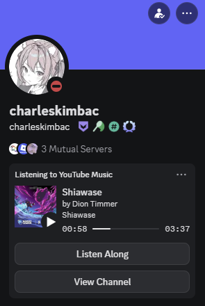

## Installation

    
    

If you've already downloaded the extension, **skip the first step!**

1. Add the [<ins>**Chrome Extension**</ins>](https://chrome.google.com/webstore/detail/youtubediscordpresence/hnmeidgkfcbpjjjpmjmpehjdljlaeaaa) from the Chrome Web Store.

   - To access personalization settings, click on the extension icon in your browser's extension menu at the top right corner of your browser.

2. Download the latest `YTDPsetup.msi` file in the [**<ins>releases</ins>**](https://github.com/XFG16/YouTubeDiscordPresence/releases) section of this repository and **run it on your device** to install the secondary desktop component.

   - **Note:** Only Windows (x64) is currently supported.

Still confused? Watch the **installation tutorial** on YouTube using [**<ins>this link</ins>**](https://www.youtube.com/watch?v=BWPNqPGFyL4).

---

# YouTubeDiscordPresence for Windows (x64)

    
    

**YouTubeDiscordPresence** (YTDP) is an application and browser extension used to create a detailed rich presence for YouTube and YouTube Music on Discord. Only **Windows (x64)** is supported, although more operating systems may be supported in the future.

 

---

## Troubleshooting/Known Issues

- The `Listen Along` and `View Channel` buttons in the rich presence don't show when looking at your own profile, but it will show for others. See the example image above. This is a Discord [**<ins>limitation</ins>**](https://github.com/discordjs/RPC/issues/180#issuecomment-2313232518).

- YouTubeDiscordPresence only works with the desktop application of Discord, **not the browser version.**

- Ensure that the `Share my activity` setting under `Activity Privacy` is **turned on.**

- The rich presence may randomly disappear and reappear within a few seconds due to Chrome forcibly unloading and reloading `background.js` in Manifest v3.

You should try fully closing your browser and Discord (from the system tray), and then reopening them.

---

## Bugs, Feature Requests, or Support

Go [here](https://github.com/XFG16/YouTubeDiscordPresence/issues/new/choose) and follow the template!

---

## Building

Desktop application:
   - `npm run compile`
   - Replace the existing `YTDPwin.exe` in `C:\Program Files\YouTubeDiscordPresence` with the newly compiled one.

   - Building the `.msi`: Download **Visual Studio 2026** with the **Microsoft Visual Studio Installer Project** extension. Open `Host\YTDPwin\YTDPsetup\YTDPsetup.vdproj` and build `YTDPsetup`.

Extension:
   - Download the `Extension` directory, compress it into a zip, and load it onto your browser manually.

   - Make sure that the `"allowed_origins"` key in the JSON file involved in [**<ins>native messaging</ins>**](https://developer.chrome.com/docs/apps/nativeMessaging/) contains the extension's ID. This file should be found at `C:\Program Files\YouTubeDiscordPresence` as `main.json`.

---

## Maintainers

- **Charles Kim** ([@charleskimbac](https://github.com/charleskimbac))

---

## Miscellaneous

**DISCLAIMER:** this is not a bootleg copy of PreMiD. On a more technical note, it works similar to the Spotify rich presence—it only appears **when a video is playing** and **disappears when there is no video or the video is paused**. In addition, it only displays the presence for videos. Idling and searching are **not displayed**. Features such as exclusions, fully customizable details, and thumbnail coverage are **unique and original** to YouTubeDiscordPresence. YouTubeDiscordPresence has not referenced nor is affiliated with PreMiD in any way whatsoever.

---

## License

Licensed under the [MIT](https://github.com/XFG16/YouTubeDiscordPresence/blob/main/LICENSE.txt) license.
