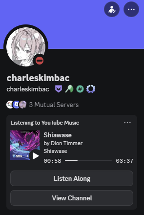

# YouTubeDiscordPresence

    
    

**YouTubeDiscordPresence** (YTDP) is a desktop application and browser extension used to create a detailed rich presence for YouTube and YouTube Music on Discord. Only **Windows (x64)** is supported, although more operating systems may be supported in the future.

 

---

## Installation

    
    

If you've already downloaded the extension, **skip the first step!**

1. Add the extension to your browser. 
    - Access personalization settings later by clicking on the extension (puzzle piece) button at the top right corner of your browser.

<a href="https://chromewebstore.google.com/detail/youtubediscordpresence/hnmeidgkfcbpjjjpmjmpehjdljlaeaaa"></img></a>
<a href="https://addons.mozilla.org/en-US/firefox/addon/youtubediscordpresence/"></img></a>

2. Download the latest `YTDPsetup.msi` file in [**<ins>Releases</ins>**](https://github.com/XFG16/YouTubeDiscordPresence/releases/latest) and **run it on your device** to install the secondary desktop component.
   - **Note:** Only Windows is currently supported.

Still confused? Watch the **installation tutorial** on YouTube using [**<ins>this link</ins>**](https://www.youtube.com/watch?v=BWPNqPGFyL4).

---

## Troubleshooting/Known Issues

- The `Listen Along` and `View Channel` buttons in the rich presence don't show when looking at your own profile, but it will show for others. See the example image above. This is a Discord [**<ins>limitation</ins>**](https://github.com/discordjs/RPC/issues/180#issuecomment-2313232518).

- YouTubeDiscordPresence only works with the desktop application of Discord, **not the browser version.**

- Ensure that the `Share my activity` setting under `Activity Privacy` is **turned on**.

Restarting your PC usually resolves any issues, especially on first install.

---

## Bugs, Feature Requests, or Support

Go [here](https://github.com/XFG16/YouTubeDiscordPresence/issues/new/choose) and follow the template!

---

## Building

Desktop application:

- `npm run compile`
- Replace the existing `YTDPwin.exe` in `C:\Program Files\YouTubeDiscordPresence` with the newly compiled one.

- Building the `.msi`: Download **Visual Studio 2026** with the **Microsoft Visual Studio Installer Project** extension. Open `Host\YTDPsetup\YTDPsetup.vdproj` and build `YTDPsetup`.

Extension:

- Download the `Extension` directory and load the extension into your browser manually.
  - Chrome: add the local extension's ID to the `allowed_origins` array at `C:\Program Files\YouTubeDiscordPresence\main.json`.

---

## Miscellaneous

**DISCLAIMER:** this is not a bootleg copy of PreMiD. On a more technical note, it works similar to the Spotify rich presence—it only appears **when a video is playing** and **disappears when there is no video or the video is paused**. In addition, it only displays the presence for videos. Idling and searching are **not displayed**. Features such as exclusions, fully customizable details, and thumbnail coverage are **unique and original** to YouTubeDiscordPresence. YouTubeDiscordPresence has not referenced nor is affiliated with PreMiD in any way whatsoever.

---

## License

Licensed under the [MIT](https://github.com/XFG16/YouTubeDiscordPresence/blob/main/LICENSE.txt) license.
